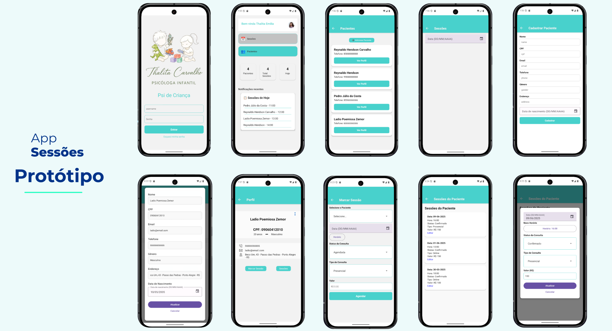

# 📱 App de Gestão de Pacientes e Sessões – React Native + Expo

Este aplicativo mobile foi desenvolvido como parte de um **projeto de extensão universitária**, com o objetivo de criar uma solução prática e acessível para a **gestão de pacientes e sessões clínicas**, especialmente voltado para o acompanhamento terapêutico.

O front-end mobile, feito em **React Native com Expo**, se comunica com um **back-end Node.js com Express e SQLite3**, hospedado em um repositório separado e dockerizado.

---

## 🎯 Objetivo do Projeto

Fornecer uma ferramenta digital para o profissional de saúde mental:

- Cadastro de pacientes
- Marcação e acompanhamento de sessões
- Atualização de dados clínicos
- Consulta de histórico de atendimentos

Além de proporcionar aprendizado prático em tecnologias modernas de desenvolvimento mobile.

---

## ✅ Funcionalidades da Aplicação

- 📋 **Cadastro de Pacientes**
- 🔎 **Listagem e Consulta de Pacientes**
- 🗓️ **Agendamento de Sessões**
- ✏️ **Atualização de Dados**

---

## 🛠️ Tecnologias Utilizadas (Front-end)

- React Native
- Expo
- React Navigation
- Axios (para integração com o back-end)

---

## 🌐 Integração com o Back-end

O aplicativo se conecta a uma **API RESTful** desenvolvida em **Node.js com Express e SQLite3**, com execução via Docker.

> 📌 **O repositório do back-end e suas instruções de execução estão disponíveis em:**  
[👉 Link para o repositório do back-end](https://github.com/reynaldo-hendson/GestaoSessaoAPI)

Antes de iniciar o app mobile, certifique-se de que o back-end está em execução.

---

## 🚀 Como Executar o App Mobile

### Pré-requisitos:

- Node.js
- Expo CLI
- Dispositivo físico com o app **Expo Go** ou um emulador Android/iOS

### Passos:

```bash
# Clone o repositório
git clone https://github.com/reynaldo-hendson/clinic-app.git

# Acesse a pasta do projeto
cd clinic-app

# Instale as dependências
npm install

# Configure o endereço IP do backend
Antes de iniciar a aplicação, é necessário ajustar a URL base da API para apontar para o IP local da sua máquina (onde o backend está rodando).

src/services/api.ts

Altere o valor de baseURL para o IP da sua máquina na rede local:

const api = axios.create({
    baseURL: "http://SEU_IP_LOCAL:3000"
});

Exemplo:
Se o IP da sua máquina for xxx.xxx.1.100, a configuração ficará assim:

const api = axios.create({
    baseURL: "http://xxx.xxx.1.100:3000"
});

# Inicie a aplicação
npx expo start

```
Após isso, abra o aplicativo Expo Go no seu dispositivo e escaneie o QR Code gerado.

📱 Telas Principais do App


👨‍💻 Autor
<table>
  <tr>
    <td>
      <a href="#">
        <br>
        <sub>
          <b>Reynaldo Hendson</b>
        </sub>
      </a>
    </td>
  </tr>
</table>

[Linkedin](https://www.linkedin.com/in/reynaldo-hendson/)

📌 Observações Finais
Este projeto tem caráter acadêmico, com foco no aprendizado de tecnologias e boas práticas de desenvolvimento mobile e web.